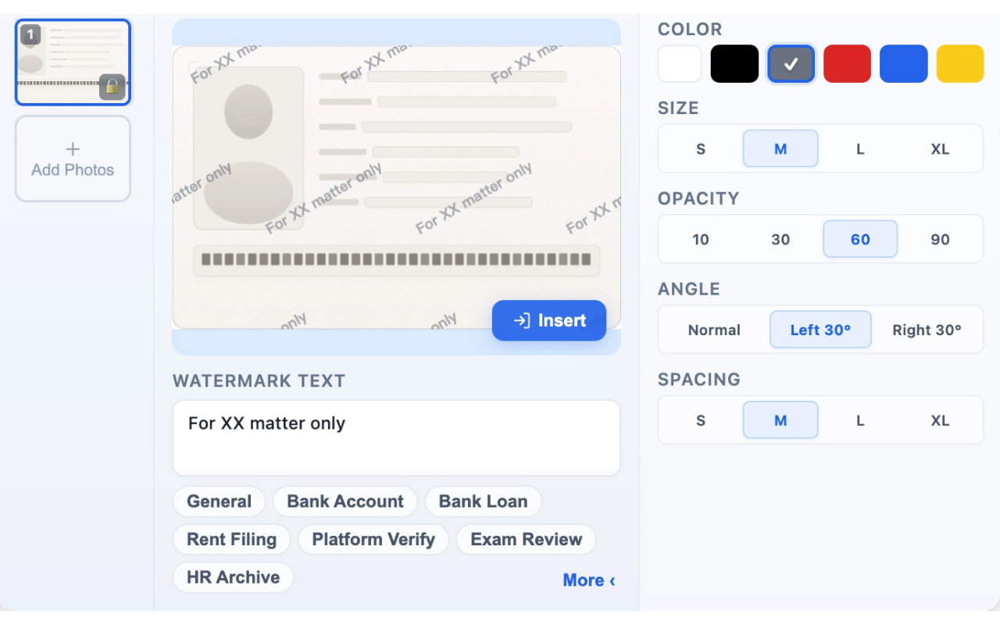

# Watermark Assistant

A Chrome extension for adding semi-transparent watermarks to ID/document photos. All processing is done locally — no data is uploaded.

## ✨ Features

- 🖼️ **Batch Processing** — Select multiple images and add watermarks in one go
- ✏️ **Custom Watermark** — Adjust text, color, size, angle, opacity, and spacing
- 🎯 **Quick Presets** — Built-in presets for common scenarios (banking, rental, exams, etc.)
- 🔌 **Page Embedding** — Auto-detects upload buttons on web pages, insert watermarked images inline
- 🔒 **Image Locking** — Lock selected images to prevent accidental deletion
- 🌍 **18 Languages** — Chinese, English, Japanese, Korean, Arabic, and more
- 🔐 **Privacy First** — All image processing happens locally in your browser

## 🌐 Supported Languages

简体中文、繁體中文、English、日本語、한국어、العربية、Español、Français、Deutsch、Italiano、Português、Русский、Nederlands、Polska、Svenska、Türkçe、Tiếng Việt、हिन्दी

## 📄 License

[MIT License](LICENSE)
